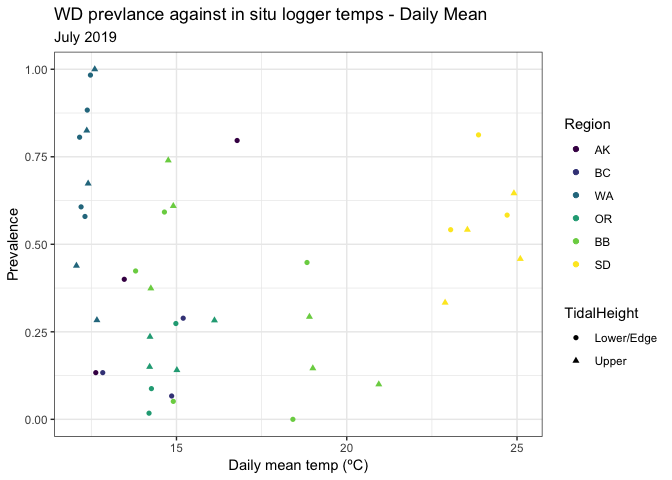
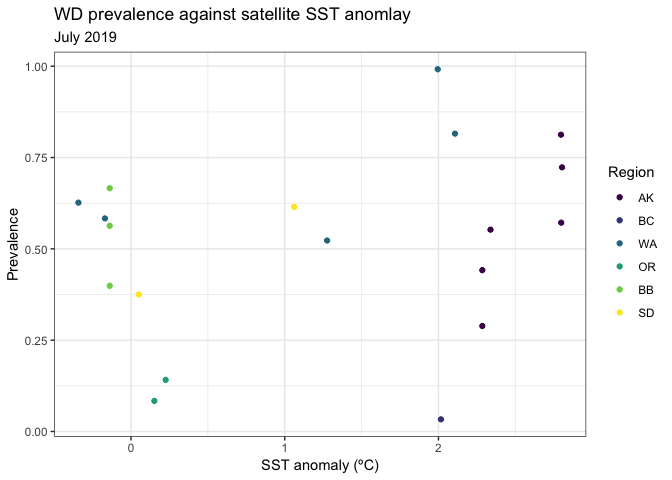

DiseaseTemp
================
LRA
1/25/2020

### Plots of wasting disease metrics against mid-summer temperature

### In situ temperatures

<!-- --><!-- -->

### Satellite temperatures

<!-- --><!-- --><!-- --><!-- -->
