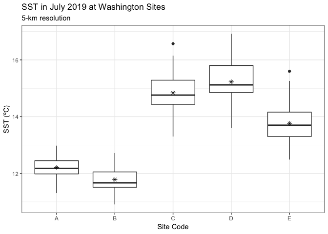
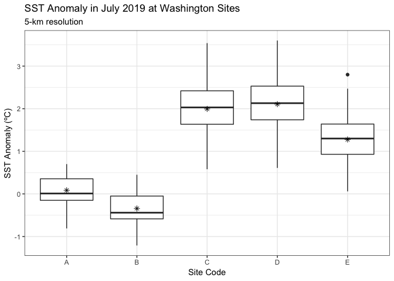

SST data for July 2019
================
LRA
1/22/2020

Here, I am using data temperature data from NOAA’s 5km Geo-Polar Blended
Night-time SST

Data were downloaded from the PacIOOS’s ERDDAP server
(<https://pae-paha.pacioos.hawaii.edu/erddap/griddap/dhw_5km.html>)

Two variables of interest: SST and SST Anomaly, which is the difference
in the SST compared to the long-term record.

Plots show the distributions of SST and SST Anomaly at the five sites in
WA surveyed for SWD in July 2019.

<!-- -->

<!-- -->

There’s somewhat of a N-S gradient, with furthest north sites C and D
(Beach Haven and North Cove) having the warmest temps and greatest
positive anomlies, and furthest south sites A and B (Fourth of July and
False Bay) having the coolest temps and lowest anomalies. Beach Haven
and North Cove also had the highest disease levels in 2019, so it will
be interesting to see if this pattern holds up at other sites.
