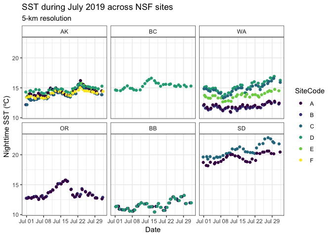
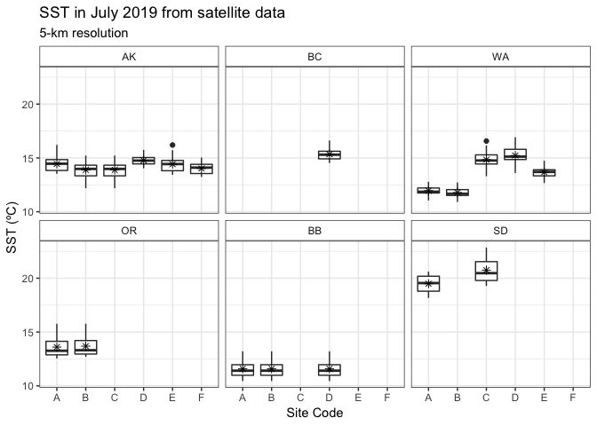
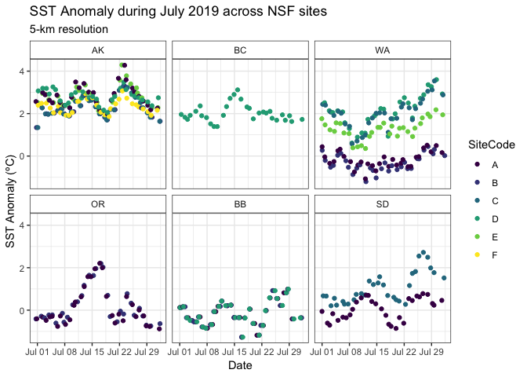
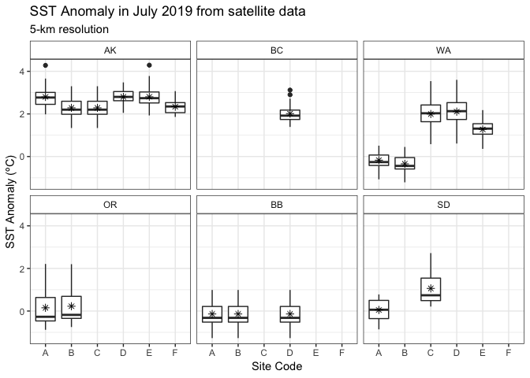

SST data for July 2019 new
================
LRA
1/24/2020

Here, I am using data temperature data from NOAA’s 5km Geo-Polar Blended
Night-time SST

Data were downloaded from the PacIOOS’s ERDDAP server
(<https://pae-paha.pacioos.hawaii.edu/erddap/griddap/dhw_5km.html>)

Two variables of interest: SST and SST Anomaly, which is the difference
in the SST compared to the long-term record.

Plots show the distributions of SST and SST Anomaly at 19 of the 32 NSF
sites surveyed for SWD in July 2019.

At the remainig 13 sites, the satellite data are not available for the
closest
pixel

<!-- --><!-- -->

<!-- --><!-- -->
